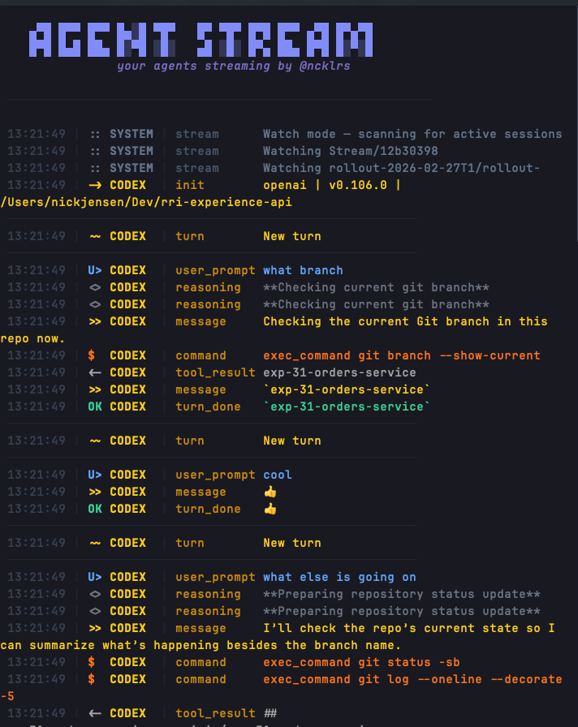

```
   ▄▀█ █▀▀ █▀▀ █▄░█ ▀█▀   █▀ ▀█▀ █▀█ █▀▀ ▄▀█ █▀▄▀█
   █▀█ █▄█ ██▄ █░▀█ ░█░   ▄█ ░█░ █▀▄ ██▄ █▀█ █░▀░█
```
**your agents streaming by @ncklrs**

A terminal UI that streams and visualizes agent events from **Claude Code** and **OpenAI Codex** in a single unified view.



## Install

```bash
uv tool install git+https://github.com/ncklrs/Agent-Stream.git
```

Or with [pipx](https://pipx.pypa.io/):

```bash
pipx install git+https://github.com/ncklrs/Agent-Stream.git
```

Requires Python 3.10+. Install [uv](https://docs.astral.sh/uv/) with `curl -LsSf https://astral.sh/uv/install.sh | sh`

For development: `git clone` then `uv pip install -e .`

## Usage

### Watch mode (default)

```bash
agentstream
```

Auto-discovers active **Claude Code** sessions under `~/.claude/projects/` and **Codex** sessions under `~/.codex/sessions/`, streaming their events live in a unified view. Claude subagent sessions are also detected. Each session gets a unique color and is labeled by its slug name (Claude) or working directory (Codex) in the sidebar.

This is the default when running on a TTY. Use `--watch` to be explicit.

### Pipe from CLI tools

```bash
# Claude Code
claude -p "refactor auth module" --output-format stream-json | agentstream

# Codex
codex exec --json "add unit tests" | agentstream
```

AgentStream auto-detects which format is being piped.

### Run agents as subprocesses

```bash
# Single agent
agentstream --exec claude "claude -p 'task' --output-format stream-json"

# Multiple agents side-by-side
agentstream \
  --exec claude "claude -p 'refactor auth' --output-format stream-json" \
  --exec codex "codex exec --json 'add tests'"
```

### Watch log files

```bash
agentstream --file codex ~/.codex/sessions/2025/01/01/session.jsonl
```

### Demo mode

```bash
agentstream --demo
```

Runs a simulated session showing both Claude and Codex events.

### Options

```bash
agentstream --max-content 500    # Wider content display (default: 200 chars)
```

## Keyboard

| Key     | Action                        |
|---------|-------------------------------|
| `space` | Pause / Resume (buffers events while paused) |
| `s`     | Toggle sidebar (stream list)  |
| `1`     | Toggle Claude events on/off   |
| `2`     | Toggle Codex events on/off    |
| `f`     | Cycle filter: All → Tools → Errors → Text |
| `/`     | Search events (Esc to clear)  |
| `d`     | Event detail view (↑↓ to navigate) |
| `t`     | Toggle timestamps (absolute / relative) |
| `e`     | Export visible events to JSONL file |
| `c`     | Clear the stream log          |
| `?`     | Help overlay                  |
| `q`     | Quit                          |

Click sessions in the sidebar to toggle individual stream visibility.

## Features

- **Watch mode** - Auto-discovers active Claude and Codex sessions (including Claude subagents) and streams them live
- **Per-session colors** - Each session gets a unique color from an 8-color palette for visual distinction
- **Session naming** - Claude sessions labeled by slug name (e.g. "hummingbird"), Codex sessions by working directory project name
- **Auto-detection** - Distinguishes Claude CLI JSONL, Codex JSONL, and Claude API SSE formats from the first line
- **Color-coded agents** - Claude in violet, Codex in green, distinct colors per action type
- **Session tracking** - Each agent session gets a sidebar entry with event counts, status, and cost
- **True pause** - Events buffer in memory while paused so nothing scrolls away; flushed on resume
- **Cost tracking** - Displays cumulative API cost from Claude result events, per-session cost in sidebar
- **Crash-resistant** - Bad JSON, broken pipes, and unknown event types are handled gracefully
- **Search** - Real-time search across event content, action types, and agent names with match highlighting
- **Action filters** - Quick-cycle through All, Tools-only, Errors-only, or Text-only views
- **Event detail** - Full-content modal with keyboard navigation through event history
- **Error notifications** - Status bar flash and persistent error counter for immediate visibility
- **Relative timestamps** - Toggle between absolute (14:23:45) and relative (2s, 1m) time display
- **Export** - Dump visible events to timestamped JSONL files for offline analysis
- **Configurable truncation** - `--max-content` flag to control event content display width
- **Session status** - Sidebar shows active/quiet/idle status with auto-detection
- **Subagent grouping** - Subagent sessions visually indented under parent sessions in sidebar

## Supported formats

| Source | Command / Path | Format |
|--------|----------------|--------|
| Claude Code CLI | `claude -p "..." --output-format stream-json` | JSONL with SDK message types |
| Claude interactive | `~/.claude/projects/` (watch mode) | JSONL with assistant/user/progress types |
| Codex CLI | `codex exec --json "..."` | JSONL with dot-separated event types |
| Codex interactive | `~/.codex/sessions/` (watch mode) | JSONL with payload-wrapped event types |
| Claude API (raw) | `curl -N .../v1/messages` | Server-Sent Events (SSE) |

## License

MIT
